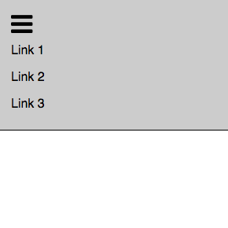

Simple Collapsable Navbar
======

<kbd></kbd>

### Why this?

Collapsable navbar templates such as Bootstrap exist but often include a lot of extra stuff that you have to remove if you just want something simpler. This is that something simpler. I wanted to build something extremely simple and easy to modify so that it can be used anything that just requires a simple navbar that collapses for a mobile screen.

With the following features:

* Responsive, simple navbar template
* Collapsable for mobile breakpoints
* Instructions in comments on how to modify & customize

Built using:

* HTML
* CSS
* A touch of JavaScript
* Normalize CDN
* Font Awesome CDN for "hamburger" icon

* Check it out here: [Link]
* Or for a version made with React and SASS, [click here]

[Link]: http://htmlnav-danbuda.surge.sh/
[click here]: https://github.com/DanBuda11/collapsable-nav
